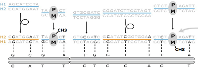

# PatMat:
  
Table of Contents
=================

* **[Full Tutorial](https://github.com/vahidAK/PatMat/blob/master/README.md#full-tutorial)**
  * [Methylation Calling from nanopore data](https://github.com/vahidAK/PatMat/blob/master/README.md#1--Methylation-Calling-from-nanopore-data)
  * [Variant Calling from nanopore data](https://github.com/vahidAK/PatMat/blob/master/README.md#2--Variant-Calling-from-nanopore-data)
  * [Phasing variants using Strand-sq data](https://github.com/vahidAK/PatMat/blob/master/README.md#3--Phasing-variants-using-Strand\-sq-data)
  * [Parent-of-origin detection](https://github.com/vahidAK/PatMat/blob/master/README.md#4--Parent\-of\-origin-detection)
  
# Full Tutorial

This workflow enables simultanous chromosome-scale haplotyping and parent-of-origin detection using a combination of nanopore sequencing and Strand-seq.
We will used nanopore-dected variants and their long-range phasing from Strand-seq to detect chromosome-scale haplotypes. We then use DNA methylation information at known imprinted regions to detect parent-of-origin.


## 1- Methylation Calling from nanopore data  
Here we use [nanopolish](https://github.com/jts/nanopolish) for methylation calling however you may use [megalodon](https://github.com/nanoporetech/megalodon) or [DeepSignal](https://github.com/bioinfomaticsCSU/deepsignal). 

### 1-1 indexing fastq file and fast5 files:

NOTE: Fastqs must be merged to a single file

```
nanopolish index -d /path/to/fast5s_directory/.fastq
```

### 1-2 Methylation calling for CpG from each read:

```
nanopolish call-methylation -t <number_of_threads> -q cpg -r /path/to/fastq_fromstep-1/fastq.fastq -b /path/to/sorted_and_indexed/bam.bam -g /path/to/reference.fa > /path/to/MethylationCall.tsv
```

For the full tutorial please refer to
[Nanopolish](https://github.com/jts/nanopolish) page on GitHub.

## 2- Variant Calling from nanopore data

Here use [Clair3](https://github.com/HKU-BAL/Clair3) to call variants. However, you may call variants with other
tools such as [deepvariant](https://github.com/google/deepvariant).

```
run_clair3.sh --bam_fn=/path/to/sorted_indexed.bam --ref_fn=/path/to/reference_genome.fa --output=/path/to/output/directory --threads=<# of threads> --platform=ont --model_path=/path/to/model/ont_guppy5_r941_sup_g5014
```
After variant calling the results will be in merge_output.vcf.gz file in the output directory. You then need to extract high uality variants:  
```
gunzip -c /path/to/output/directory/merge_output.vcf.gz | awk '$1 ~ /^#/ || $7=="PASS"' > /path/to/output/Passed_Clair3_Variants.vcf
```  

## 3- Phasing variants using Strand-sq data
  

## 4- Parent-of-origin detection

### 4-1 First you need to process methylation call file using [NanoMethPhase](https://github.com/vahidAK/NanoMethPhase) methyl_call_processor module.

```
nanomethphase methyl_call_processor -mc MethylationCall.tsv -t 20 | sort -k1,1 -k2,2n -k3,3n | bgzip > MethylationCall.bed.gz && tabix -p bed MethylationCall.bed.gz
```
