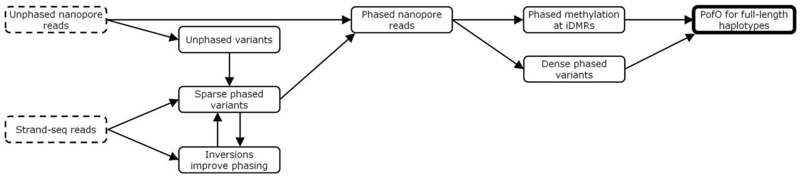

# PatMat:  
  

This workflow enables simultaneous chromosome-scale haplotyping and parent-of-origin detection in a single sample without any parental data using a combination of nanopore sequencing and Strand-seq.
We will use nanopore-detected variants and their long-range phasing from Strand-seq to detect chromosome-scale haplotypes. We then use DNA methylation information at known imprinted regions to detect parent-of-origin.  

**Citation:** [Parent-of-origin detection and chromosome-scale haplotyping using long-read DNA methylation sequencing and Strand-seq (https://www.cell.com/cell-genomics/fulltext/S2666-979X(22)00191-4)  

# Installation
The workflow is basically two parts, the nanopore analysis part and the Strand-seq analysis part. All the tools needed to run the workflow can be installed by downloading/cloning this repository as explained below.  

To use the tools in this repository and run the workflow, you can download the latest release or clone the repository and install the required dependencies in the [patmat_env.yml](https://github.com/vahidAK/PatMat/blob/main/env.yml) as follow:  

**NOTE:** You must have conda and mamba installed before installation.

To clone and install:
```
git clone https://github.com/vahidAK/PatMat.git
cd PatMat
bash -l ./install.sh
# Now you need to activate the environment, open R, and install InvertypeR:
conda activate patmat
R
devtools::install_github("vincent-hanlon/InvertypeR")

``` 
OR to download the latest release and install:
```
VERSION=1.4.0
wget https://github.com/vahidAK/PatMat/archive/refs/tags/v"$VERSION".tar.gz && tar -xzf v"$VERSION".tar.gz
cd PatMat-"$VERSION"/
bash -l ./install.sh
# Now you need to activate the environment, open R, and install InvertypeR:
conda activate patmat
R
devtools::install_github("vincent-hanlon/InvertypeR")

```
# Tutorial
## Running all the steps from an alignment file through the nextflow workflow
The above commands will create three conda environments (including patmat, ashleys_patmat-wf, and clair3_patmat-wf), which allows running all the steps for PofO-aware phasing from a nanopore bam file with methylation tags. We have provided a nextflow workflow, [patmat_workflow.nf](https://github.com/vahidAK/PatMat/blob/main/patmat_workflow.nf), that can run all the steps from a long-read alignment file with methylation tags, including variant calling, phasing, strand-seq data analysis, and PofO-aware phasing. During workflow run, Nexflow will generate a ```work``` directory and store temp files there. Final results are moved to their respective folders. After a successful run, you may remove the ```work``` folder.    
NOTE: The workflow only supports hg38 or T2T-CHM13v2Hs1 mapped data.  
NOTE: Reference file must be indexed by samtools and must also include indexes for bowtie2 (You can use bowtie2-build for indexing. For bowtie2 indexing, you must use the reference name as base name).

```
conda activate patmat
# Running workflow for nanopore data.
nextflow -bg run patmat_workflow.nf -with-report -with-conda \
  --reference absolute/path/to/reference.fa \
  --bam absolute/path/to/alignment.bam \
  --output absolute/path/to/output/directory \
  --strandseq_fq absolute/path/to/strand-seq/fastq/directory \
  --processes number_of_processes \
  --patmat_dir absolute/path/to/PatMat_installed-cloned_directory \
  --clair3 --sample_id sample_id

# Running workflow for PacBio data.
nextflow run path/to/patmat_workflow.nf -with-report -with-conda \
  --reference absolute/path/to/reference.fa \
  --bam absolute/path/to/alignment.bam \
  --output absolute/path/to/output/directory \
  --strandseq_fq absolute/path/to/strand-seq/fastq/directory \
  --processes number_of_processes \
  --patmat_dir absolute/path/to/PatMat_installed-cloned_directory \
  --deepvar_model PACBIO \
  --hifi --sample_id sample_id
```
Run patmat_workflow.nf --help to see the help and all the options, and also the default options for phasing and strand-seq steps, and specify them accordingly if needed.  
The default assumption for strand-seq data is paired-end. If your data is single-end, also add the --single option. If your data are paired-end, the paired reads must be in two different fastq files, and the files must be named like UniqueID_R1.fastq and UniqueID_R2.fastq OR *_R1.fq and *_R2.fq (gzipped .gz files are allowed. e.g. *_R1.fastq.gz). Unique ID will be a unique ID of each sequenced cell.  
To send a job to the background, add -bg (nextflow -bg run ...).  
You can use the -resume flag when rerunning a failed run to start from the step that failed (nextflow run patmat_workflow.nf -resume ...).  
  
## Running steps separately
Alternatively, if you already have variant data and just want to run strand-seq steps and patmat, or you want to access all the options from them that may not be covered in the nextflow script, you can run them as follows:  
For variant calling from long-read data, you can use [Clair3](https://github.com/HKU-BAL/Clair3) or [DeepVariant](https://github.com/google/deepvariant). We also recommend phasing your VCF file after variant calling, either using the internal function of these tools or via [whatshap](https://github.com/whatshap/whatshap) or [longphase](https://github.com/twolinin/longphase) afterwards, and use the phased VCF for patmat.  
### Analysis of strand-seq data
#### Adapter trimming, alignment, and mark duplicates
You first need to do adapter trimming, alignment, and mark duplicates of your strand-seq fastq files. Here is an example for paired-read data. You need to run the following command for each cell's fastq(s) separately. Make sure to use unique names for the output files of each cell so you do not overwrite them when analyzing data from the next cell.
```
conda activate patmat
# Adapter trimming. Run cutadapt -h for more details.
cutadapt \
  -a Pair1_3prime_adapter \
  -g Pair1_5prime_adapter \
  -A Pair2_3prime_adapter \
  -G Pair2_5prime_adapter \
  -o Reads.1.trimmedOutput.fastq.gz \
  -p Reads.2.trimmedOutput.fastq.gz \
  input_reads_1.fastq input_reads_2.fastq \
  -m minimum_length -q quality-cutoff -j number_of_processes

# Alignment to reference, sorting, and indexing. Run bowtie2 -h for more details.
mkdir StrandSeq_Bams
bowtie2 --rg-id read_group_ID --rg read_group -x bowtie_indexed_reference_base_name \
  -p number_of_processes -1 Reads.1.trimmedOutput.fastq.gz -2 Reads.2.trimmedOutput.fastq.gz | \
  samtools sort -@ number_of_processes -o StrandSeq_Bams/out_temp.bam
samtools index -@ number_of_processes StrandSeq_Bams/out_temp.bam

# Mark duplicate, see Picard help for more details.
picard MarkDuplicates -I StrandSeq_Bams/out_temp.bam \
  -O StrandSeq_Bams/out_MarkedDup.bam \
  -M StrandSeq_Bams/out_MarkedDup.metrics
samtools index -@ number_of_processes StrandSeq_Bams/out_MarkedDup.bam 
rm StrandSeq_Bams/out_temp.bam
```
#### QC of strand-seq bams using Ashleys
We use ashleys-qc to determine low-quality data and will only use high-quality data for downstream analysis.
```
conda activate ashleys_patmat-wf
mkdir ashleys_pass
mkdir ashleys_fail
# Run ashleys-qc -h for more details.
ashleys.py -j number_of_processes \
  features \
  -f StrandSeq_Bams (folder with aligned bams) \
  -w 5000000 2000000 1000000 800000 600000 400000 200000 \
  -o output_ashleys_features.tsv

ashleys.py -j number_of_processes \
  predict -p output_ashleys_features.tsv \
  -o output_ashleys_quality.tsv \
  -m path_to_ashleys_model (you can find ashleys model in the third_parties folder in the PatMat cloned/installed path)

awk 'NR>1 && $2==1 { print $1 }' output_ashleys_quality.tsv | \
  xargs -i cp StrandSeq_Bams/{} \
    StrandSeq_Bams/{}.bai ashleys_pass
```
#### Phasing long-read detected variants using strand-seq data
```
conda activate patmat
# Run strandseq_phase.R -h for more details.
strandseq_phase.R \
  -p TRUE \
  -i ashleys_pass \
  -o StrandPhase_output_folder \
  -t number_of_processes \
  -n sample_id -bg bsgenome_version \
  --hard_mask which_hard_mask_file_to_use \
  --soft_mask which_soft_mask_file_to_use \
  --inversion_list which_inversion_list_to_use \
  path/to/long-read/vcf
```
You can find hard mask (hard_mask.*.bed), soft mask (soft_mask.*.bed), and inversion (hanlon_2021_BMCgenomics_augmented.*.bed) files in the Strand-seq folder in the PatMat cloned/installed path.  
  
### PofO-Aware phasing using patmat
After getting the phased vcf from the previous step, we can run patmat to do PofO-aware phasing.
```
conda activate patmat
# Run patmat -h for more details.
# for nanopore data
patmat \
  -v path/to/long-read/vcf \
  -b path/to/long-read/bam -stv path/to/strand-seq_phased.vcf \
  -o output_prefix \
  -p number_of_processes \
  -ref path/to/reference

# for pacbio data
patmat.py \
  -v path/to/long-read/vcf \
  -b path/to/long-read/bam -stv path/to/strand-seq_phased.vcf \
  -o output_prefix \
  -p number_of_processes \
  -ref path/to/reference -pb
```
The default imprinted list is for hg38 in patmat. If you are using the T2T reference, select the appropriate imprinted list from the patmat folder in the PatMat cloned/installed path using the -kd option.  
  
# Outputs
PatMat will generate multiple outputs.
## PofO_Assigned vcf file(s) 
These files represent the results after assigning the parent-of-origin to variants. For small variant vcf file, for phased (1|0 or 0|1) variants the last column includes Mat|Pat (1|0. Ref is maternal and alt is paternal), or Pat|Mat (0|1. Ref is paternal and alt is maternal) and for the phased 1|2 variants the last column includes Ref_Mat|Pat (the part before comma on the 5th column, or 1st alt allele, is maternal and the part after comma, or 2nd alt allele, is paternal) or Ref_Pat|Mat (the part before comma on the 5th column, or 1st alt allele, is paternal and the part after comma, or 2nd alt allele, is maternal).  
If an SV variant vcf file is also provided, PofO results will be PofO_Assignment_SVs.vcf and the parental origin of SV is directly written in the 10th column.  

## PofO_Tagged.cram
This is the PofO tagged alignment file. Haplotype 1 represents the maternal haplotype, and haplotype 2 represents the paternal haplotype.  

## Variant_Assignment_info.tsv
This file includes some stats regarding PofO assignment for small variants. If a SV vcf file is provided, Variant_Assignment_SVs_info.tsv file will be also produced that stores some stats for the SV variants.  

## CpG-Methylation-Status-at-DMRs 
This file represents the status of methylation at iDMRs on each haplotype. If a chromosome could not be assigned a PofO or the PofO score for a chromosome is low, you can manually inspect this file to better understand the methylation status at the iDMRs for the chromosome.  

## PofO_Scores.tsv 
This file includes the PofO assignment score along with some more information for each chromosome. 

